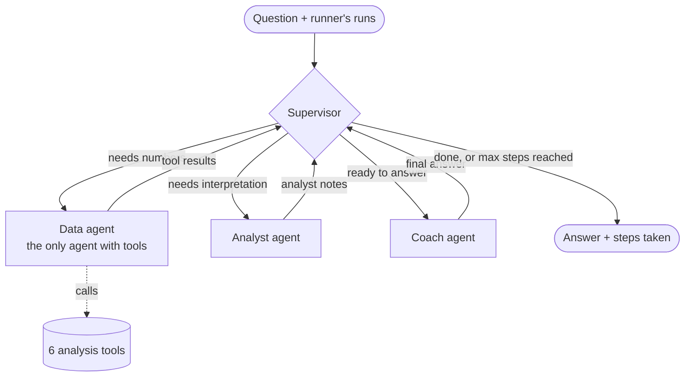

# Progress

## Step 0 — Project setup ✅

### What was done
- Created the folder structure: `data/raw/` and `data/processed/` (git-ignored, kept with `.gitkeep`), `notebooks/`, `src/running_coach/` with `data/`, `analysis/` and `agents/` sub-packages, `app/`, `tests/` and `docs/`.
- Added `pyproject.toml` (src layout, pytest `testpaths = tests`), `.gitignore`, `.env.example` and `CLAUDE.md`.
- Created a Python 3.12 virtual environment in `.venv` and installed `requirements.txt`.
- Installed the project in editable mode (`pip install -e .`), so `import running_coach` works everywhere.
- Pinned every library in `requirements.txt` to the installed version (`==`).
- Wrote `src/running_coach/llm.py`: `get_chat_model()` loads `.env`, checks that `GOOGLE_API_KEY` and `GEMINI_MODEL` are set (clear error if not) and returns a `ChatGoogleGenerativeAI` model. `python -m running_coach.llm` sends a test message and prints Gemini's reply.
- Added a placeholder `README.md`.
- Initialised Git and pushed the first commit to GitHub: https://github.com/AlexOBotija/RUNIN

### Decisions taken
- **Python 3.12** in a virtual environment (`py -3.12 -m venv .venv`). It is installed next to Python 3.14; 3.12 is a stable version that all our libraries support.
- **src layout + editable install.** The package code lives in `src/running_coach/`. `pip install -e .` lets notebooks, tests and the app import it without path tricks, and code changes work without reinstalling.
- **Pinned versions.** Only the 9 top-level libraries are pinned (pandas 3.0.6, pyarrow 25.0.1, langgraph 1.2.12, langchain 1.4.3, langchain-google-genai 4.4.0, streamlit 1.64.0, plotly 7.1.0, python-dotenv 1.2.4, pytest 9.1.1). Streamlit Cloud (Step 6) will install exactly the versions we tested.
- **Model: `gemini-3.5-flash-lite`** (free tier: 15 RPM, 250K TPM, 500 RPD).
  - The first choice was `gemini-3.8-flash`, but its free tier is only 5 RPM and 20 RPD.
  - One question uses about 4–6 LLM calls (supervisor, data agent, analyst, coach), so 20 RPD means only 3–5 questions per day. That is too few for development.
  - 500 RPD gives about 80–120 questions per day. The Python tools do the calculations, so a "Lite" model is good enough for choosing tools and writing the answers.
  - The model name is read from `.env`, so changing it later needs no code change.
- **A dedicated Google AI Studio project** for this app. Free-tier limits are counted per project, not per key, so other apps no longer use this app's budget.
- **Local Git identity** (this repository only, not global): Alexandre Andrade, alexandrade4444@gmail.com.
- **Secrets stay out of Git.** `.env` is git-ignored; only `.env.example` (with empty values) is committed.

### Things to remember
- Activate the venv in every new PowerShell window: `.\.venv\Scripts\Activate.ps1` (you should see `(.venv)`). Without it, `pip` installs into the global Python.
- Each run of `python -m running_coach.llm` uses 1 of the 500 daily requests.

## Step 1 — Data ✅

### What was done
- `src/running_coach/config.py`: shared project paths (`RAW_DIR`, `PROCESSED_DIR`) and `get_sample_size()`, which reads `SAMPLE_SIZE` from `.env` (default 1000). `SAMPLE_SIZE=1000` added to `.env.example`.
- `src/running_coach/data/download.py` (`python -m running_coach.data.download`): downloads `run_ww_2019_d.parquet` from Figshare into `data/raw/`. It skips files that already exist and writes to a `.part` file first, so a broken download is never mistaken for a finished one.
- `src/running_coach/data/prepare.py` (`python -m running_coach.data.prepare`, about 3 minutes):
  - `clean_runs()`: the one shared cleaning helper (keeps running days, adds `pace`, applies the rules below).
  - `build_sample(sample_size=1000, seed=42)`: saves `data/processed/sample.parquet`.
  - `build_reference_table()`: saves `data/processed/reference.parquet` (percentiles by level from all 2019 athletes).
  - `summarize_athletes()`: one row per athlete with `weekly_km`, `pace`, `runs_per_week` and `level`.
- `tests/test_prepare.py`: 9 tests on tiny hand-made tables (each cleaning rule, values on the limits, the 10-runs filter, rest weeks counted as 0).
- `notebooks/01_explore.ipynb`: sizes, distance and pace distributions, runs per week, athletes per level (sample vs all 2019) and the reference table. Saved with outputs so the charts show on GitHub.
- `requirements-dev.txt`: `jupyter==1.1.1` and `matplotlib==3.11.2` (plus everything in `requirements.txt`).

### The raw data
- Source: Figshare, DOI 10.6084/m9.figshare.16620238.v5, licence CC BY 4.0.
- We use only `run_ww_2019_d.parquet` (154.7 MB). Weeks can be built from days, but not the other way round. The 2020 files (COVID year), the COVID CSVs and the Power BI dashboard are not needed.
- 13,290,380 rows: one row per athlete per day for all 365 days; 65% of rows are rest days (distance 0). 36,412 athletes. No missing values, no duplicate days.
- Runs on the same day are added together (two 10 km runs = one 20 km day).
- The full table uses about **1,274 MB** of RAM in pandas.

### Cleaning rules (in `clean_runs`, one place for both files)
| Rule | Why |
|---|---|
| distance > 0 and duration > 0 | keep only days with running (removes rest days, avoids dividing by 0) |
| distance ≥ 0.5 km | shorter is usually a watch started by accident |
| distance ≤ 100 km | more in one day is almost always a GPS or typing error (max in raw data: 390 km) |
| pace between 2.5 and 15 min/km | faster than 2.5 is faster than the 10K world record (~2:37/km): GPS error or a bike ride; slower than 15 is walking or a watch left running |
| athlete has ≥ 10 clean runs in 2019 | fewer runs is too little data to analyse (used for both the sample and the reference table) |

The rules remove only about 0.5% of running days. The 100 km and 15 min/km limits already cap duration at 25 h, so no separate duration rule is needed.

### Weekly averages and levels
- Weeks go from Monday to Sunday (`resample("W-SUN")`), like Strava.
- Each athlete's weeks go from their **first to their last run** of 2019. Rest weeks in the middle count as 0 km; weeks before they started or after they stopped do not count.
- Average pace = total minutes / total km, so long runs count more than short jogs.
- Levels by average weekly distance (each band includes its lower edge): **under 10, 10-20, 20-40, 40-60, 60+ km**. "40+" was split because the dataset has many marathon runners; 40-60 and 60+ are clearly different (median pace 5.25 vs 4.93 min/km). The smallest level still has 3,778 athletes.

### Results
| File | Size | Content |
|---|---|---|
| `sample.parquet` | 1.74 MB (6.5 MB in RAM) | 133,562 runs, 1,000 athletes; columns `datetime, athlete, distance, duration, gender, pace` |
| `reference.parquet` | 7.5 KB | 5 rows (one per level): `n_athletes` + p25/p50/p75 of `weekly_km`, `pace`, `runs_per_week` |

- Same seed → identical sample (checked by running `build_sample` twice).
- The sample represents the population: 133.6 runs per athlete in both, same median distance (10.0 km) and pace (5.29 min/km), level shares within 1 percentage point.
- Changing the eligible list (e.g. a new cleaning rule) changes which athletes the seed picks. That is expected: a seed makes results repeatable only for the same input.

### Why we process the full data once, and the app loads only the small files
The full 2019 file needs about 1.3 GB of RAM and about 3 minutes to process. Free Streamlit hosting gives about 1 GB of RAM, and the app would repeat that work on every start. So the heavy work runs **once, on the laptop**. The app only loads the 1.7 MB sample and the 7.5 KB reference table, which is fast and fits easily in memory. The agents also get small summaries, never raw data.

### Things to remember
- New machine or new clone: `pip install -r requirements-dev.txt`, then `python -m running_coach.data.download`, then `python -m running_coach.data.prepare`.
- The data files are git-ignored; anyone who clones the repo rebuilds them with the two commands above.
- For Step 2: in `pace`, a lower number means faster. Reuse `summarize_athletes()`, `LEVEL_EDGES` and `LEVEL_LABELS` instead of writing the weekly logic again.

## Step 2 — Analysis functions ✅

### What was done
- `src/running_coach/data/loaders.py`: `load_sample()`, `load_reference()` and `get_athlete_runs(athlete_id)`. A missing file gives a clear error ("Run: python -m running_coach.data.prepare"); an unknown athlete gives a `ValueError`. Runs come back sorted by date with the columns `date, distance_km, duration_min, pace_min_km` (units in the names). The Strava data in Step 6 will be converted to the same 4 columns.
- `src/running_coach/analysis/metrics.py`: 6 functions (`weekly_volume`, `pace_trend`, `consistency`, `load_ramp`, `longest_run`, `compare_to_peers`) plus `format_pace()` (5.5 → "5:30").
- `tests/test_metrics.py`: 36 tests on tiny hand-made tables (45 tests in total with Step 1), with at least one edge case per function, the exact limits of the load-ratio labels, and a `json.dumps()` check for every function.
- Checked on 3 sample athletes (13, 30974 with 365 runs, 22771 with only 54 days of history) and on a hand-made 1-run table: nothing crashes, every output passes `json.dumps()` and is under 1,000 characters.

### Output format (same for every function)
- `"status"`: `"ok"` or `"not_enough_data"`. When there isn't enough data, the dictionary has only `status` and a short `note`; it never raises an error.
- Plain Python numbers, rounded (km 1 decimal, pace 2 decimals), dates as `"YYYY-MM-DD"`, pace also as `"m:ss"` text.
- A short `"note"` that explains the numbers to the reader (the AI in Step 3).
- No DataFrames and no raw runs: the agents get small summaries, never raw data.

### Decisions taken
- **"The last N weeks" = N blocks of 7 days ending on `end_date`.** By default `end_date` is the runner's **last run date**: the dataset is from 2019, so ending today would give empty weeks for everyone. Every week has 7 full days, so "last week vs the week before" is a fair comparison (Mon–Sun weeks would often make the last week look short). Every week-based function takes an optional `end_date` (e.g. today, for Strava data). Weeks before the first run are not counted; the output gives `weeks_analysed`.
- **`weekly_volume`**: km per week (rest weeks = 0) and % change between the last two weeks. `change_pct` is `null` when the previous week had 0 km. Needs 2 weeks of history.
- **`pace_trend`**: weekly pace = total minutes / total km. A straight line (linear trend, `numpy.polyfit`) through the weekly paces; weeks without runs are skipped but keep their position in time. Slope in seconds per km per week: **below −2 = improving, above +2 = getting worse, otherwise stable** (lower pace = faster). Needs 3 weeks with runs.
- **`consistency`**: runs per week, average and weeks with zero runs. A window with zero runs is a valid answer ("ok" with zeros), not "not enough data".
- **`load_ramp`**: acute = km in the last 7 days; chronic = km in the last 28 days / 4. **Ratio < 0.8 low, 0.8–1.3 normal, > 1.3 high risk** (limits included in "normal"; the rounded ratio is labelled, so label and number always match). A guideline from sports science (Gabbett 2016), not a medical rule. Needs 28 days of history.
- **`longest_run`**: longest run in the window and its % of the 7-day week that contains it. In the public dataset a "run" is one day.
- **`compare_to_peers`**: uses **all** the runner's runs and `summarize_athletes()` from Step 1 — the same method that built the reference table — so we compare like with like. Position: below p25 / between p25 and p75 (inclusive) / above p75, plus plain words; for pace "below p25" = **faster** than most. Needs 14 days between first and last run.

### Things to remember
- Weekly pace is noisy (athlete 30974 goes from 4:35 to 5:36 between weeks), so the trend label is a hint. The note says so, and the Coach should not overstate it.
- The ratio label "high risk" is a guideline. The Coach must phrase it as "you increased quickly", never as a medical warning.
- `get_athlete_runs` reads the sample file on every call. That's fine now; in Step 5 Streamlit will cache it.

## Step 3 — First single agent ✅

### What was done
- `src/running_coach/agents/tools.py`: the 6 Step 2 functions wrapped as LangChain tools (`@tool`), listed in `ALL_TOOLS`. The docstrings are written for the LLM: what the tool returns and which questions it is for.
- `src/running_coach/agents/single_agent.py`: `SYSTEM_PROMPT`, `AgentState` (`messages` + `runs`), `build_agent()` (the graph) and `ask(question, runs)`.
- `src/running_coach/llm.py`: `call_with_retry()`, and `get_chat_model()` now turns off the library's own retries (`max_retries=1`).
- `scripts/ask.py`: `python scripts/ask.py --athlete 30974 "Is my pace improving?"`. Prints the athlete, the tools called (with arguments), the number of LLM calls and the answer. `--verbose` also prints each tool result. Without `--athlete` it picks a random sample athlete.
- Step 2 change: `weekly_volume` now also returns `total_km` (see the test results below).
- New tests, none of them call the API (69 tests in total):
  - `tests/test_tools.py` (16): each tool, run by a real `ToolNode` for athlete 30974, gives the same result as calling the metric function directly; the LLM's view of every tool has no `runs` argument; a bad `weeks` (0 or 53) goes back to the LLM as an error, not a crash. Skipped if the processed data files are missing.
  - `tests/test_retry.py` (5): fake function and fake `sleep`. Succeeds on try 3 after waiting 10 s and 20 s, gives up after 3 tries, doesn't retry other errors, `max_retries == 1`.
  - `tests/test_single_agent.py` (3): the whole graph with a fake chat model (scripted replies): agent → tools → agent → END; a question without tools ends after 1 LLM call; the step limit stops a model that never stops calling tools.

### The graph
```
START -> agent --(did the LLM ask for tools?)-- yes -> tools -> back to agent
                                               +-- no  -> END
```
- **agent** node: system prompt + conversation → Gemini (with the tool descriptions from `bind_tools`) → one reply.
- **tools** node: LangGraph's `ToolNode`. Runs every tool the LLM asked for, injecting `runs` from the state.
- **Conditional edge** after `agent`: tool calls in the reply → `tools`, otherwise → `END`.
- Built by hand with `StateGraph` (not the prebuilt `create_agent`), so every piece is visible and Step 4 reuses the same pattern.

### Decisions taken
- **The runner's data comes from the state, never from the LLM.** The tools take `runs: Annotated[pd.DataFrame, InjectedState("runs")]`. LangGraph fills it from `state["runs"]` and hides it from the LLM. The LLM only chooses which tool to call and `weeks` (limited to 1–52 with a pydantic `Field`). It can't pick the wrong athlete or invent data.
- **The state holds the runs DataFrame, not an athlete id.** The tools don't care where the runs come from, so the Strava data in Step 6 works with no change, and the sample file is read once per question, not once per tool.
- **`compare_to_peers` loads the reference table itself** (7.5 KB, the same for every runner).
- **The system prompt is added on every LLM call, not stored in the state**, so the state only holds the real conversation.
- **Step limit: `recursion_limit=10`** (each node run is one step; a normal question takes 3). At most 5 LLM calls, then LangGraph stops with `GraphRecursionError` instead of using up the quota.
- **`build_agent(model=None)`**: tests pass a fake model (dependency injection); the app uses Gemini.

### System prompt rules
1. Every number must come from a tool result. Never guess, estimate or calculate new numbers.
2. `not_enough_data` → say the data is not enough and why (use the note).
3. Questions the data can't answer (shoes, food, gear) → say so, give one short general tip with no numbers and no brand names, and list what it can answer.
4. No medical advice, no diagnosis; pain or injury → see a doctor or physiotherapist. "High risk" = "you increased your distance quickly". Don't use "risk" for a normal or low load.
5. The data ends on the runner's last run, not today; say which dates the numbers cover.
6. Lower pace = faster; use the tool's "m:ss" text.
7. Simple, friendly English, about 120 words at most.

### LLM calls and free-tier limits
- Free tier for `gemini-3.5-flash-lite`: **15 requests per minute, 500 per day**.
- One question = **2 LLM calls** (1: choose tools, which can be several in one reply; 2: write the answer). A question that needs no tool = **1 call**. Maximum 5 (step limit).
- So about **7 questions per minute** and **about 250 per day**. During development the per-minute limit is the one we are most likely to hit (many questions in a row).
- Step 4 has 4 agents, so expect more calls per question there.
- This step used 17 LLM calls in total.

### Retry approach
- The Gemini library retries rate-limit errors 6 times **silently** by default. With our retry around it, one call could become up to 18 hidden requests, so we set `max_retries=1` (1 attempt, no hidden retries).
- `call_with_retry(func)`: up to 3 tries, waiting 10 s and then 20 s (the wait doubles: exponential backoff). Only `ModelRateLimitError` (HTTP 429) is retried; other errors (wrong key, a bug) are raised at once because they would fail again. After the last try: a clear `RuntimeError` (per-minute limit → wait a minute; daily limit → try tomorrow). It prints a line every time it waits.
- The agent node calls `call_with_retry(lambda: model_with_tools.invoke(messages))`.

### Results of the 5 test questions (athlete 30974)
| Question | Tools called | LLM calls | Result |
|---|---|---|---|
| How much did I run in the last 4 weeks? | `weekly_volume(weeks=4)` | 2 | 378.6 km in total, 4 weekly values, average 94.6 km, −8.6%, dates 2019-12-04 to 2019-12-31 |
| Is my pace improving? | `pace_trend()` (8 weeks) | 2 | "improving" with the 8 weekly paces as m:ss and the note that pace is a hint, not proof |
| Am I running more than other people at my level? | `compare_to_peers()` | 2 | level 60+ km; weekly km and pace typical; runs per week above p75 |
| Am I increasing my distance too fast? | `load_ramp()` | 2 | no: 96.7 km vs 94.6 km usual, ratio 1.02, normal |
| What shoes should I buy? | none | 1 | can't answer from the data + one general tip (get fitted at a running shop), no numbers or brands |

Every number in the final answers comes from a tool result. Also checked: a random athlete (6601, `consistency`) works.

**Problems found in the first run, and fixed:**
- Q1: Gemini added the 4 weeks itself: "378.5 km". That breaks rule 1, and it was even slightly wrong (it added the rounded weekly values; pandas gives 378.6). Fix: `weekly_volume` now returns `total_km`, so the natural "how much?" question has a tool number.
- Q2: Gemini chose `weeks=4` for the pace trend, which is too noisy. Fix: the `pace_trend` docstring says to use at least 8 weeks unless the runner asks about a period.
- Q4: "carries a normal risk". Fix: rule 4 says not to use "risk" for a normal or low load.

Two of the three fixes were text (a docstring and the prompt), not logic: with agents, tool descriptions and prompts change behaviour, so we check them with real questions.

### Things to remember
- When the runner gives no period, Gemini often chooses `weeks=4` (e.g. for `consistency`). Fine for volume and consistency; for trends the docstring now asks for 8.
- On Windows, if `ask.py` output is redirected to a file or pipe and fails on special characters, set `$env:PYTHONUTF8=1`.
- For Step 4: reuse `ALL_TOOLS`, `call_with_retry` and the `runs`-in-state pattern; only the Data agent gets the tools. `ask.py` counts LLM calls by counting `AIMessage`s.

## Step 4 — Multi-agent system ✅

### What was done
- `src/running_coach/agents/crew.py`: the crew. `CrewState` (the shared state), `SupervisorPlan`, `make_plan()`, `choose_next()` (the router), `build_crew()` (the graph with the 4 agents and their prompts) and `ask(question, runs)`, which returns the final state.
- `scripts/ask.py`: uses the crew by default and prints the steps taken, the LLM calls, the time and the answer. `--single` runs the Step 3 agent; `--verbose` also prints the tool results and the analyst's notes.
- `scripts/compare.py`: asks the 5 Step 3 questions to both versions and prints the answers plus a summary table (calls, seconds, words, `Next week:` lines). It waits 20 s between questions to stay under 15 requests per minute.
- `single_agent.py`: new `count_llm_calls()`, used by both scripts.
- `docs/single_vs_multi.md`: the comparison (results table, answer quality, prompt fixes, limitations, when to use each approach).
- `tests/test_crew.py` (13 tests, 82 in total, none of them call the API):
  - routing, plain Python: the plan for simple, complex and no-data questions; the router follows the plan in order; a simple question goes from data straight to coach; the analyst is skipped when there are no usable numbers; **when the step count reaches `MAX_STEPS`, the router goes to `END`**.
  - the whole graph with a fake model: simple question = 3 LLM calls without the analyst; complex question = 4 calls; shoes = coach only, 2 calls; **only the data agent has the analysis tools** (the fake records which tools were bound for each LLM call); a bad tool argument becomes an `"error"` result, and the analyst is skipped.

### The graph

(Checked in mermaid.live: it renders. Ready to reuse in the README.)

- **Supervisor (hybrid):** on its first visit, **1 LLM call** with `with_structured_output(SupervisorPlan)` returns `needs_data`, `needs_analysis` and `reason`. `make_plan()` (Python) turns that into an ordered list: `["coach"]`, `["data", "coach"]` or `["data", "analyst", "coach"]`. On every visit, `choose_next()` (Python, no LLM) picks the first agent in the plan that hasn't run yet. The supervisor writes it into `next_agent`, and the conditional edge follows it.
- **Data agent:** 1 LLM call with `bind_tools(ALL_TOOLS)`; Gemini chooses all the tools in one reply. **Python then runs them** with `runs` from the state (`run_tool()`), and the results go into `tool_results` as `{"weekly_volume(weeks=4)": {...}}`. There is no second "summary" call: that is the analyst's job.
- **Analyst:** the plain model with no tools. It gets the question and the tool results (JSON) and writes at most 5 bullet notes for the coach.
- **Coach:** the plain model with no tools. It gets the question, the tool results and the notes, and writes the answer: under 130 words, ending with exactly one `Next week:` line.
- Every agent goes back to the supervisor (hub and spoke).

### The shared state (`CrewState`)
`question`, `runs` (DataFrame, read only by the tools), `plan`, `tool_results`, `analyst_notes`, `final_answer`, `next_agent`, `step_count`, plus 3 fields with an `operator.add` **reducer** (a node returns only its new items, and LangGraph adds them): `steps` (text for the app), `agents_done`, `llm_calls`.

### Decisions taken
- **Hybrid supervisor:** the LLM makes the one decision that needs language understanding (what kind of question is this?), and Python makes the bookkeeping decisions (who is next, when to stop). This saves 2–3 calls per question compared with an LLM call after every agent, and Python guarantees a valid order (the analyst never runs before the data agent).
- **Skip the analyst when there are no usable numbers** (no tool called, or no result with status `"ok"`). It's a Python rule, so it saves a call.
- **Only the data agent has tools.** The analyst and coach can only use numbers the tools really calculated, and each role has one clear job. The test proves it from behaviour, not by reading the code.
- **The runs stay in the state** (not an athlete id), same as Step 3, so the Strava data in Step 6 needs no change.
- **The coach always ends with `Next week: ...`.** That makes "exactly one suggestion" checkable by code, and the app can highlight it.
- **`call_with_retry` around every LLM call** (supervisor, data, analyst, coach).

### Max steps
- **`MAX_STEPS = 6`**: the supervisor can send work to an agent at most 6 times. The longest normal path needs 3 (data, analyst, coach), so the limit is double. When `step_count` reaches 6, `choose_next()` returns `END`, and the steps list says so.
- With Python routing a loop shouldn't happen, but the guard protects the free-tier quota if the routing changes later (for example, an LLM deciding every step).
- Second safety net: LangGraph's `recursion_limit = 2 * MAX_STEPS + 2 = 14` node runs. Our own check always stops first.

### LLM calls per question
| Question type | Path | LLM calls |
|---|---|---|
| Simple fact ("How much did I run?") | supervisor → data → coach | **3** |
| Needs interpretation ("Am I improving?") | supervisor → data → analyst → coach | **4** |
| No data needed ("What shoes?") | supervisor → coach | **2** |

Single agent for comparison: 2 (1 without tools). On the free tier (500 per day) that's about 150 crew questions per day. This step used about **96 LLM calls** (3 comparison runs, 2 pain-question runs and some spot checks).

### Main findings of the comparison (`docs/single_vs_multi.md`)
- **Crew: 3.4 calls and 4.0 s on average; single agent: 1.8 calls and 2.5 s.** About 1.9× the calls but only 1.6× the time (the analyst's and coach's calls are short).
- **Accuracy is the same:** every number in every answer comes from a tool result, in both versions.
- **The crew is more consistent:** short answers (53–75 words), always exactly one `Next week:` line, visible steps, and the pain rule in one place. Pain question: the crew recommended a doctor or physiotherapist and extra rest, not more distance.
- **The single agent gives more detail** (all weekly values) and has fewer hand-overs where meaning can get lost.
- **Choice for the app: the crew.**

### Prompt fixes found with real questions
1. The coach dropped the pace "hint, not proof" caveat and used jargon (a slope) → the analyst reports the limits of the numbers; the coach explains technical values in plain words.
2. The shoe question's tip wasn't about shoes → the tip must be about the topic of the question.
3. "Base it on their numbers" made the coach invent targets ("95 km", "6.89 runs per week") → say the suggestion in words, compared with current training.
4. The coach copied rule text to the runner ("...and don't suggest running more") → the rule separates "what to tell the runner" from "what you must not do".

### Things to remember
- **Known limitations** (in the doc): the coach often copies the prompt's example suggestion ("keep the same weekly distance"); it once added the pace caveat to a peer comparison; small rounding (19.1 → 19). Possible fix: several different examples in rule 9, and "only when a tool note says so" in rule 8.
- The Google library prints a warning once per run ("Direct use of automatic function calling (AFC)…"). It's harmless; it comes from the library, not our code.
- For Step 5: call `crew.ask(question, runs)` and show `result["final_answer"]`, `result["steps"]` and optionally `tool_results` / `analyst_notes`. Cache the loaded data and the built crew (`build_crew()` once), not the answers. One question takes about 3–5 s, so show a spinner.

## Step 5 — Streamlit app ✅

### What was done
- `app/streamlit_app.py` (`streamlit run app/streamlit_app.py`):
  - **Sidebar:** data source ("Sample runner" or "Upload Strava export"); a dropdown of the 1,000 sample IDs plus a "🎲 Random runner" button; a "Weeks in the charts" slider (4–52, default 12); for uploads, a "What we assumed about your file" expander.
  - **Top:** 4 key numbers (km this week with % change, runs this week, average pace, level) and 2 Plotly charts (weekly km with the peer band, weekly pace).
  - **Bottom:** chat with the crew, 3 example question buttons, the answer with the `Next week:` line highlighted, and a "How the agents worked" expander (the steps, AI calls and seconds, the tool numbers and the analyst's notes).
- `src/running_coach/charts.py`: `weekly_distance_chart(volume, peers)` and `pace_chart(trend)`. They only take analysis-function results, never LLM output.
- `src/running_coach/data/strava.py`: `load_strava_csv(file)` returns `(runs, notes)`: the runs in our 4 columns and a list of plain-English assumptions. Any unusable file raises `StravaFormatError` (a `ValueError`) with a clear message.
- `src/running_coach/llm.py`: new `RateLimitReached(RuntimeError)`, raised by `call_with_retry` after the last try, so the app can recognise "API limit reached" without reading the error text. `scripts/ask.py` still works because it is a `RuntimeError`.
- `.streamlit/config.toml`: the theme (committed; `secrets.toml` stays git-ignored).
- `.gitignore`: added `.claude/` (local config of the Claude Code preview pane, not part of the project).
- New tests (97 in total, none of them call the API):
  - `tests/test_strava.py` (10): tiny fake CSVs written in the test. Metres and km give the same `distance_km`; non-runs are removed; wrong columns, a non-CSV file and a rides-only file give a clear `StravaFormatError`; same-day runs are added; elapsed time is used when moving time is missing; both regional date formats; the cleaning rules.
  - `tests/test_app.py` (5, `streamlit.testing.v1.AppTest`): the page loads with sample runner 30974 and the key numbers equal the analysis results, **without building the crew**; an example button asks the (fake) crew and shows "How the agents worked"; a new runner clears the chat; a rate limit shows the friendly message; a wrong upload shows the friendly message and stops the page.

### How Streamlit works (the 3 ideas used)
- **The script reruns from top to bottom** on every click or message. Normal variables are forgotten each time.
- **`st.session_state`** keeps values between reruns: the chosen runner (`athlete_id`, connected to the dropdown with `key=`), the chat history (`messages`) and which runner the chat belongs to (`chat_runner`).
- **Caching:** `@st.cache_data` for data (reference table, athlete list, one runner's runs, an uploaded file keyed by its bytes) returns a saved copy. `@st.cache_resource` for the crew graph returns the same shared object. Answers are never cached.

### Decisions taken
- **"This week" = the 7 days ending on the runner's last run**, the same rule as the tools, so the numbers on the page match the chat answers. The caption says which date the data ends on.
- **The crew is built on the first question, not when the page opens.** The charts work without an API key, and the app test proves that opening the page makes no LLM call.
- **Each question is independent.** The chat history is only shown on the page; the crew has no memory of earlier questions. A new runner or a new file starts a new chat (old answers were about someone else).
- **Example buttons** in a horizontal container (`st.container(horizontal=True)`): each button is as wide as its text and wraps on small screens. Equal columns cut "Am I increasing my distance too fast?" off.
- **Random button with a callback** (`on_click`): it runs before the rerun, so the dropdown already shows the new runner.
- **Friendly errors, never a red traceback:** API limit (`RateLimitReached`), API key missing (`RuntimeError`), too many steps (`GraphRecursionError`), anything else (generic message; details printed in the terminal). Wrong file (`StravaFormatError`) and missing data files have their own messages. Not enough data → "–" in the key numbers and an info box with the tool's note instead of a chart.

### Strava export: columns and assumptions
Checked in other projects that read `activities.csv` (Athlytics source code, Daniel Roelfs' blog post):

| Column | What we found | What we do |
|---|---|---|
| `Activity Type` | Run, Ride, Walk, … | keep `Run`, `Trail Run`, `Virtual Run` (case and spaces ignored) |
| `Distance` (appears **twice**) | pandas renames the second to `Distance.1`; it is in **metres** | use `Distance.1` / 1000. With only one `Distance` column: median above 100 → metres, otherwise km. Miles not supported. |
| `Moving Time` | seconds, without stops | the duration (matches Strava's pace). Empty or 0 → `Elapsed Time` for that run. |
| `Elapsed Time` (appears twice) | seconds, with stops | fallback only |
| `Activity Date` | `Feb 17, 2022, 12:18:26 PM` or `19 Feb 2022, 10:14:12` (depends on region) | `pd.to_datetime(format="mixed")` |

- Same-day runs are **added together** (one row per day, like the public dataset), so "runs per week" and the level compare fairly with the reference table.
- The **same cleaning rules as Step 1** (`clean_runs()` is reused): 0.5–100 km, pace 2:30–15:00 min/km.
- The export must be in **English** (otherwise the column names differ and the user gets the "missing columns" message).
- **Not confirmed yet (check with the real file in Step 6):** the time zone of `Activity Date` (probably UTC, so a run near midnight can land on the wrong day) and the unit of the *first* `Distance` column (we avoid it when the metres column exists).

### Design choices
- **Palette:** pastel backgrounds with deeper data colours of the same family, all checked with a colour validator (contrast at least 3:1 on the page background, readable with colour blindness).
  - Page `#FBFAF7` (warm off-white), sidebar `#EEF5F1` (pale sage), text `#2B2D42` (dark blue-gray), buttons/slider `#2F9670`.
  - Weekly km bars `#2F9670` (deep sage), pace line `#C8693F` (terracotta), peer band `#D9D3F0` (pastel lavender).
  - The first idea (pastel bars and lines, `#8FBFA8` / `#F4A988`) failed the check: only about 2:1 contrast, too pale to read.
- **Layout:** wide page; title and short caption; runner name and "data ends on …" caption; 4 key numbers in a row; 2 charts side by side (they stack on a phone); a thin divider; the chat. No boxes around sections.
- **Charts:** one data series per chart, so no legend: the subtitle explains the band ("Band: typical for 60+ km runners (65–85 km)"). Pace axis reversed (up = faster) with "m:ss" tick labels. Plotly toolbar hidden; `theme=None` keeps our colours.
- Always light (`base = "light"`), even when the visitor's computer uses dark mode.

### Final checks (all passed)
- `pytest -v`: 97 passed.
- `streamlit run app/streamlit_app.py --server.headless true` → `http://localhost:8501/_stcore/health` returned `ok`.
- Real question through the app ("Am I increasing my distance too fast?", runner 30974): an answer (96.7 km in the last 7 days vs 94.6 km usual, normal load) + "How the agents worked" (data → analyst → coach, `load_ramp()` and `weekly_volume(weeks=8)`, 4 AI calls, 5.3 s). Every number comes from a tool result.
- `git status`: no data files, no `.env`, no `secrets.toml`; no `AIza` key text in any file Git can see.
- This step used **8 LLM calls** (2 real questions).

### Things to remember
- Run the app: `streamlit run app/streamlit_app.py` (venv active, from the project root). Stop with `Ctrl+C`.
- On Windows, scripts that print emojis (🎲, 👟) to a redirected terminal need `$env:PYTHONUTF8=1`.
- For Step 6:
  - Check `strava.py` with the real `activities.csv`: time zone, the units, and the number of runs/dates/km against what Strava shows.
  - The analysis tools end "this week" on the last run. For live Strava data, "today" might be better (every week-based function already takes `end_date`, but the crew's tools don't pass it yet).
  - The app reads `GOOGLE_API_KEY` through `get_chat_model()` (from `.env`). On Streamlit Cloud it must come from `st.secrets`.
  - `sample.parquet` and `reference.parquet` are git-ignored, so the cloud won't have them yet.

## Next: Step 6 — My Strava data + deployment
