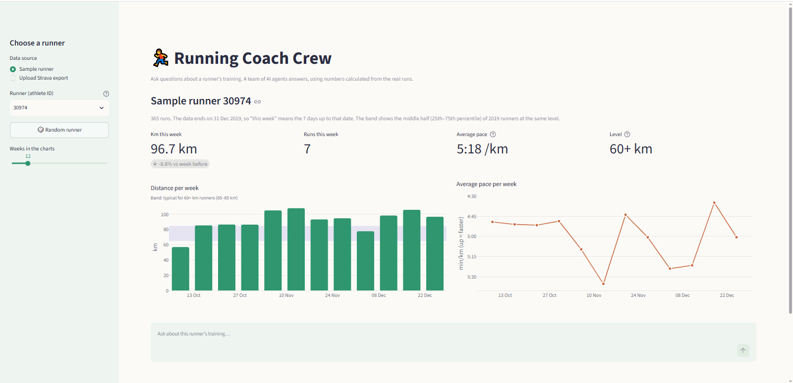
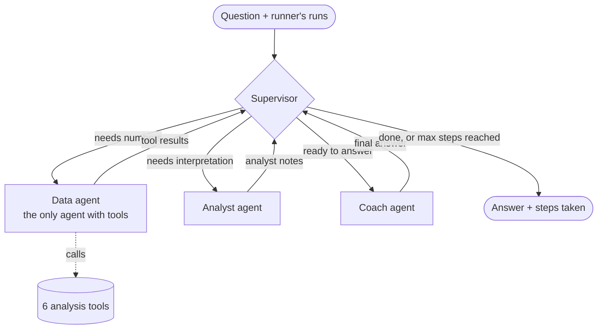
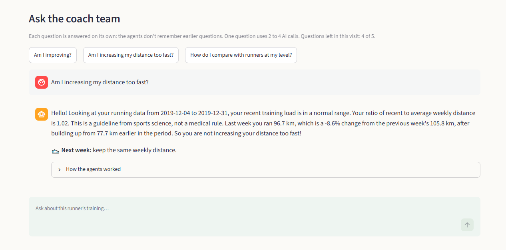

# Running Coach Crew

Ask questions about your running in plain English, and a small team of AI agents answers like a coach.

**Live app:** https://running-coach-crew.streamlit.app



## What it does

You pick a runner from a public dataset, or upload your own Strava export. The app shows your weekly distance and pace next to runners at your level. Then you can ask questions like "Am I improving?" or "Am I increasing my distance too fast?". Four agents work together to answer: they calculate the numbers with Python, interpret them, and write a short answer with one suggestion for next week.

## Architecture

The agents are built with LangGraph. They share one state and never talk to each other directly: every agent reports back to the supervisor.



**Supervisor.** It reads the question and makes one LLM call to decide two things: does the answer need the runner's numbers, and do the numbers need interpretation? Python turns that into a plan, for example data, then analyst, then coach. After that, routing is plain Python with no more LLM calls. A step limit stops the graph if it ever loops.

**Data agent.** The only agent with tools. It chooses which of the 6 analysis functions to call: weekly volume, pace trend, consistency, load ramp, longest run and comparison with peers. Python runs them on the runner's data. Each tool returns a small summary (a few numbers and a short note), never the raw runs.

**Analyst agent.** No tools. It reads the tool results and writes short notes for the coach: the key numbers, patterns, warning signs in the training, and the limits of the numbers. It is skipped when there are no usable numbers.

**Coach agent.** No tools. It writes the final answer in simple English, under 130 words, using only numbers from the tools. It ends with exactly one "Next week:" suggestion. It never gives medical advice: if the runner mentions pain, it suggests seeing a doctor or a physiotherapist.

Under each answer, "How the agents worked" shows the plan, the tools called, the numbers they returned and the analyst's notes.



## Data

**Public dataset.** The sample runners come from "A public dataset on long-distance running training in 2019 and 2020" by BMClab (Federal University of ABC, Brazil). It has daily distance and duration for 36,412 athletes. I only use the 2019 daily file.

- Dataset page: https://bmclab.pesquisa.ufabc.edu.br/datasets/run_ww_19_20/
- Data files (Figshare, CC BY 4.0): https://doi.org/10.6084/m9.figshare.16620238.v5
- Paper: Afonseca LA, Watanabe RN, Duarte M. 2022. A worldwide comparison of long-distance running training in 2019 and 2020: associated effects of the COVID-19 pandemic. PeerJ 10:e13192. https://doi.org/10.7717/peerj.13192

**Why a 1,000-athlete sample and a reference table.** The full 2019 file is 155 MB and needs about 1.3 GB of memory in pandas. The free Streamlit hosting has about 1 GB. So the heavy work runs once, on my laptop, and creates two small files:

- `sample.parquet` (0.64 MB): every clean run of 1,000 random athletes (133,562 runs). These are the runners you can pick in the app. I checked that the sample has the same median distance, pace and level mix as the full data.
- `reference.parquet` (7.5 KB): statistics from all 34,760 athletes with at least 10 clean runs in 2019. Runners are split into 5 levels by average weekly distance (under 10, 10-20, 20-40, 40-60 and 60+ km). For each level, the table has the 25th, 50th and 75th percentiles of weekly km, pace and runs per week.

The reference table means a runner is compared with people who train like them. Comparing someone who runs 15 km a week with a marathon runner doing 70 km would not tell them much.

Cleaning rules: distance between 0.5 and 100 km per day, and pace between 2:30 and 15:00 min/km.

**Your own Strava data.** You can upload `activities.csv` from your Strava archive. The app keeps only runs, converts the file to the same columns as the public dataset (date, distance, duration) and applies the same cleaning rules. Strava writes dates in UTC, so they are converted to your browser's time zone. Runs on the same day are added together, like in the public dataset. A sidebar box lists every assumption made about your file. The file is only used in your session. I tested this with my own Strava export, which is not in this repository.

## Tech stack

- Python 3.12, pandas, pyarrow
- LangGraph and LangChain for the agents
- Google Gemini API (`gemini-3.5-flash-lite`, free tier)
- Streamlit for the app, Plotly for the charts
- pytest: 113 tests, none of them call the API (they use fake models)
- Streamlit Community Cloud for hosting

## How to run locally

You need Python 3.11 or newer (I used 3.12), Git and a free Gemini API key from [Google AI Studio](https://aistudio.google.com/apikey). The small data files are already in the repository, so you don't need to download the dataset.

### Windows (PowerShell)

```powershell
git clone https://github.com/AlexOBotija/RUNIN.git
cd RUNIN
py -3.12 -m venv .venv
.\.venv\Scripts\Activate.ps1
pip install -r requirements.txt
Copy-Item .env.example .env
notepad .env
```

If `Activate.ps1` is blocked, run `Set-ExecutionPolicy -Scope Process -ExecutionPolicy Bypass` first. It only applies to this PowerShell window.

### Mac / Linux

```bash
git clone https://github.com/AlexOBotija/RUNIN.git
cd RUNIN
python3.12 -m venv .venv
source .venv/bin/activate
pip install -r requirements.txt
cp .env.example .env
nano .env
```

### Then (both systems)

1. In `.env`, fill in your key and the model name, then save:
   ```
   GOOGLE_API_KEY=your-key-here
   GEMINI_MODEL=gemini-3.5-flash-lite
   ```
   `.env` is in `.gitignore`, so your key is never committed.
2. Start the app. It opens at http://localhost:8501.
   ```
   streamlit run app/streamlit_app.py
   ```
3. Run the tests (no API key needed):
   ```
   pytest
   ```

You can also ask a question from the terminal:

```
python scripts/ask.py --athlete 30974 "Am I improving?"
```

### Rebuild the data (optional)

This downloads the 155 MB raw file into `data/raw/` and builds the two small files again. It takes a few minutes and about 1.3 GB of memory.

```
python -m running_coach.data.download
python -m running_coach.data.prepare
```

`SAMPLE_SIZE` in `.env` changes how many athletes go into the sample (default 1000). The exploration notebook (`notebooks/01_explore.ipynb`) needs `pip install -r requirements-dev.txt`.

## Design decisions and trade-offs

**A crew of agents instead of one agent.** I built a single agent first (one LLM with all the tools) and then the crew, and asked both the same 5 questions. The crew used about 1.9 times the LLM calls (3.4 vs 1.8 per question) and 1.6 times the time (4.0 s vs 2.5 s). Accuracy was the same: every number came from a tool in both versions. The crew was more consistent: short answers, always one "Next week:" line, the medical rule in one place, and steps you can show in the app. So the app uses the crew. Full results: [docs/single_vs_multi.md](docs/single_vs_multi.md).

**The supervisor plans once, and Python routes.** Only the first decision needs language understanding (what kind of question is this?). Choosing the next agent and stopping are simple rules, so Python does them. This saves 2 to 3 LLM calls per question, and the analyst can never run before the data agent.

**Tools return summaries, not data.** The runner's runs stay in the graph state. The LLM chooses which tool to call and simple settings like the number of weeks, but it never sees or changes the runs. Each tool returns a small dictionary with rounded numbers and a note, so prompts stay short and every number in an answer can be traced back to a calculation. The charts and key numbers use the same functions, not LLM output.

**Free-tier limits.** Gemini's free tier allows 15 requests per minute and 500 per day. One question uses 2 to 4 LLM calls, depending on the plan. To protect the quota, each visitor can ask 5 questions per visit, and the whole app answers at most 60 questions per day (about 240 requests). If Gemini says "rate limit" or "busy", the app waits 10 s, then 20 s, and tries again. If it still fails, the visitor sees a friendly message, not an error.

## Limitations and future ideas

Limitations:

- "This week" means the 7 days up to the runner's last run, not today.
- The dataset only has distance and duration per day. There is no heart rate, elevation or type of run (easy or hard), so the pace trend is only a hint.
- Peer groups are based on weekly distance only.
- The Strava file must be exported in English, with distances in km or metres (not miles).
- Each question is answered on its own: the agents don't remember earlier questions.
- The daily question counter lives in memory, so it starts again from 0 when the cloud app restarts.
- On the free tier, the first question after the app wakes up can take much longer than usual.

Future ideas:

- Use heart rate and elevation, for example from the Strava API or from .fit files, to separate easy and hard runs.
- More data sources: connect to Strava directly instead of uploading a file, or read Garmin exports.
- Better peer groups: the dataset also has age group, gender and country, so runners could be compared with people of the same age and level.
- Remember the conversation, so follow-up questions work.
- A small set of test questions with expected answers, to check the agents automatically after a prompt change.

## Project structure

```
app/streamlit_app.py          the Streamlit app
src/running_coach/
    agents/crew.py            supervisor, data agent, analyst and coach (LangGraph)
    agents/single_agent.py    the single agent, kept for the comparison
    agents/tools.py           the analysis functions as LangChain tools
    analysis/metrics.py       the 6 analysis functions (pandas)
    data/                     download, prepare, loaders and the Strava reader
    charts.py                 Plotly charts
    llm.py                    Gemini model and retry
    limits.py                 the daily question limit
scripts/                      ask.py and compare.py (terminal)
tests/                        pytest tests
docs/single_vs_multi.md       single agent vs crew comparison
```

## What I learned

*I will write this section myself.*

## License

MIT. See [LICENSE](LICENSE). The dataset is CC BY 4.0, by the authors cited above.
