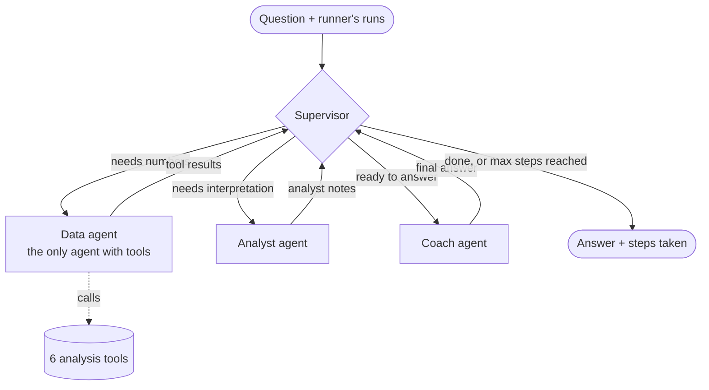

# Single agent vs multi-agent crew

The same 5 questions, asked to the Step 3 **single agent** and the Step 4 **crew**
(supervisor, data agent, analyst, coach), for athlete 30974 (60+ km level, data ends on
2019-12-31). Model: `gemini-3.5-flash-lite` (free tier). Run on 2026-10-02 with
`python scripts/compare.py`.

## The two designs

**Single agent:** one LLM chooses the tools, reads the results and writes the answer.

```
START -> agent --(tools asked?)-- yes -> tools -> back to agent
                               +-- no  -> END
```

**Crew:** each role is a separate agent. They share one state, and only the data agent has tools.



The supervisor makes **one** LLM call to plan (does the question need numbers? does it
need interpretation?). After that, plain Python routes the graph with no more LLM calls.

## Results

| # | Question | Single: calls | Single: time | Crew: path | Crew: calls | Crew: time |
|---|---|---|---|---|---|---|
| Q1 | How much did I run in the last 4 weeks? | 2 | 2.9 s | data → coach | 3 | 3.7 s |
| Q2 | Is my pace improving? | 2 | 2.7 s | data → analyst → coach | 4 | 4.7 s |
| Q3 | Am I running more than other people at my level? | 2 | 2.7 s | data → analyst → coach | 4 | 4.7 s |
| Q4 | Am I increasing my distance too fast? | 2 | 2.6 s | data → analyst → coach | 4 | 4.3 s |
| Q5 | What shoes should I buy? | 1 | 1.8 s | coach only | 2 | 2.7 s |
| | **Average** | **1.8** | **2.5 s** | | **3.4** | **4.0 s** |

The crew uses about **1.9× the LLM calls** and takes about **1.6× the time**. The time
grows less than the calls, because the analyst's and coach's calls are short.

Times are from one run on one laptop. Gemini's speed changes from call to call, so read
them as "roughly", not exact.

## Answer quality

| # | Single agent | Crew | Better |
|---|---|---|---|
| Q1 | Correct total (378.6 km), all 4 weeks and the −8.6% change. | Correct total, average, highest and last week. Shorter, and it adds a suggestion. | Tie |
| Q2 | "Improving", the 5:09 → 5:00 weekly paces and the "only a hint" caveat. | "Improving", 5:09 → 5:00, about 19 s/km faster, and the "hint, not proof" caveat. Shorter and clearer. | Crew (slightly) |
| Q3 | Correct: typical distance and pace, runs more often than most (above p75). | Same facts, but it added a "pace is only a hint" caveat that doesn't apply to this tool. | Single |
| Q4 | Correct: ratio 1.02, normal, 96.7 vs 94.6 km. | Same facts, plus the tool's note "a guideline, not a medical rule". | Crew (slightly) |
| Q5 | Can't answer from the data; one good tip (get fitted at a running shop). | Same, with the tip as the "Next week:" line. | Tie |

**What both do well:** every number in every answer comes from a tool result. Neither
version invented data, and both said which dates the numbers cover.

**What the crew adds:**
- **The same format every time:** a short answer under 130 words that ends with exactly
  one `Next week:` suggestion (checked automatically for all 5 answers: 53–75 words, 1
  line each). The single agent's prompt doesn't ask for a suggestion, so this is partly a
  difference in the prompts, not only in the design.
- **Visible reasoning:** the steps list shows the plan and its reason, the tools that were
  called, and whether the analyst ran. The Streamlit app (Step 5) will show it.
- **Safety in one place:** the pain rules live only in the coach's prompt. With *"My knee
  hurts after long runs, should I run more?"*, the crew recommended a doctor or
  physiotherapist and suggested extra rest days, not more distance.

**What the single agent does better:**
- **Cheaper and faster:** 1.8 calls and 2.5 s on average.
- **More detail when you want it:** for example, all the weekly values in Q1 and Q2.
- **Fewer places where meaning can get lost:** in the crew, the analyst summarises the
  numbers for the coach, and a mistake in that hand-over (like the wrong caveat in Q3)
  reaches the final answer.

## Prompt fixes needed during the comparison

The crew needed 4 prompt fixes to reach the results above. Each one came from reading the real answers:

1. The coach dropped the "pace is only a hint" caveat and used jargon ("weekly slope of
   −2.7 sec/km per week") → the analyst now reports the limits of the numbers, and the
   coach explains technical values in plain words.
2. For the shoe question, the "Next week:" tip had nothing to do with shoes → the tip
   must be about the topic of the question.
3. "Base the suggestion on their numbers" made the coach invent targets ("aim for 95 km",
   "keep your runs at 6.89 per week") → the suggestion must be in words, relative to
   current training.
4. For the pain question, the coach copied the rule text to the runner ("...and don't
   suggest running more") → the rule now separates what to tell the runner from what
   the coach must not do.

## Known limitations

- **The example in the prompt is copied too often:** after fix 3, three of the five
  suggestions were exactly "keep the same weekly distance", the example in the prompt.
  They're correct, but bland. Giving several different examples (or none) should help.
- **A caveat used where it doesn't apply:** Q3's "pace is only a hint" (see above).
- **Small rounding:** "19.1 s/km" became "19 seconds per km" in Q2.
- **5 questions, 1 athlete and 1 run each** is a small test. LLM answers change a little
  between runs.

## When each approach is better

| Use a **single agent** when… | Use a **crew** when… |
|---|---|
| questions are simple facts ("how much did I run?") | questions need interpretation (trends, "too much?", comparison with peers) |
| API quota or response time matters most | answers must always follow the same format (a suggestion, safety rules) |
| there are only a few tools and one clear job | you want to show the reasoning steps to the user |
| you are building a first prototype | you want to change or test one role without touching the others (for example a new data agent for Strava data) |

**Our choice for the app: the crew.** The extra ~1.5 seconds and ~1.6 calls per question
are affordable on the free tier (500 requests per day ≈ 150 crew questions). In return we
get a consistent answer, a "Next week:" suggestion, and visible steps, which is the point
of a coaching app.
